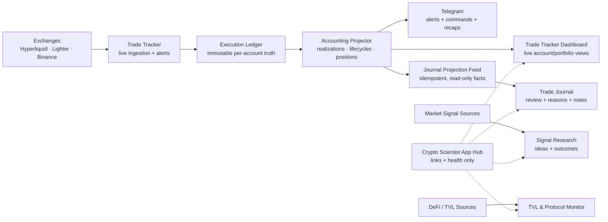
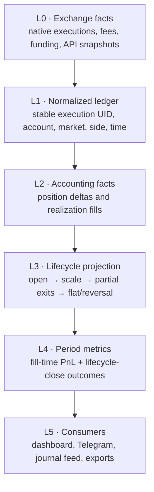
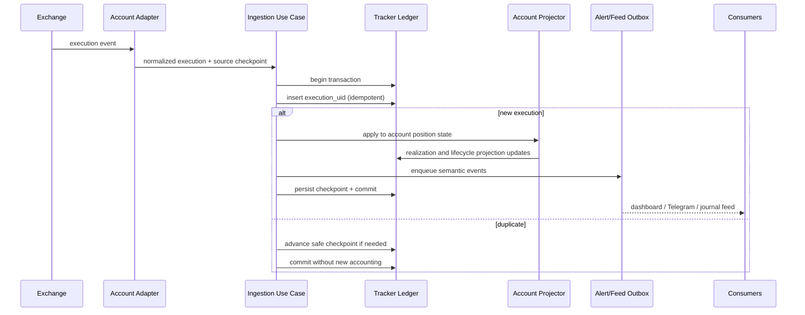
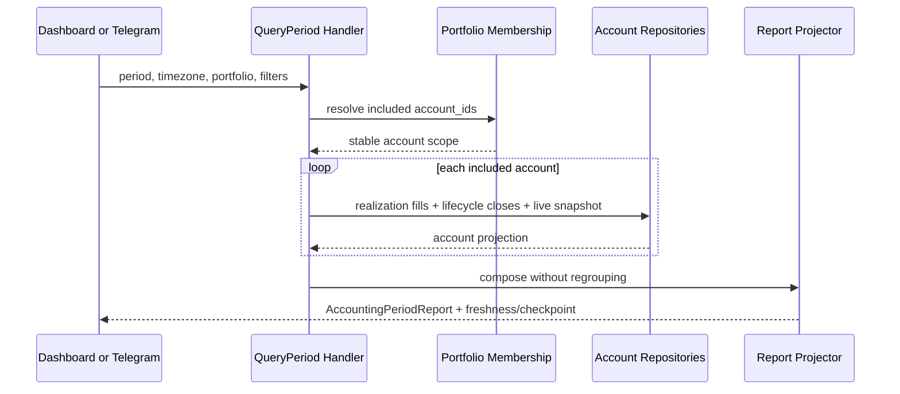
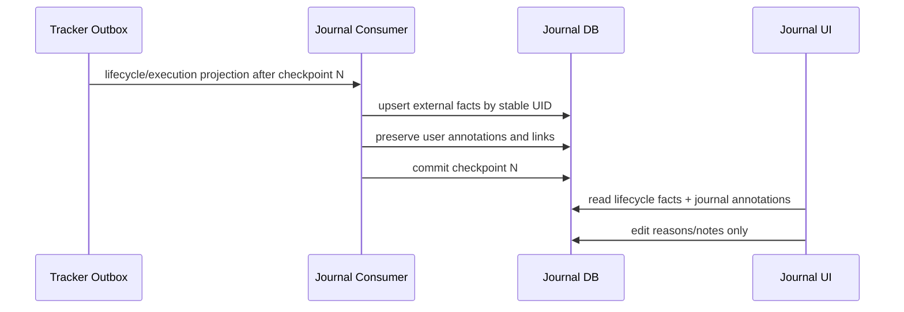
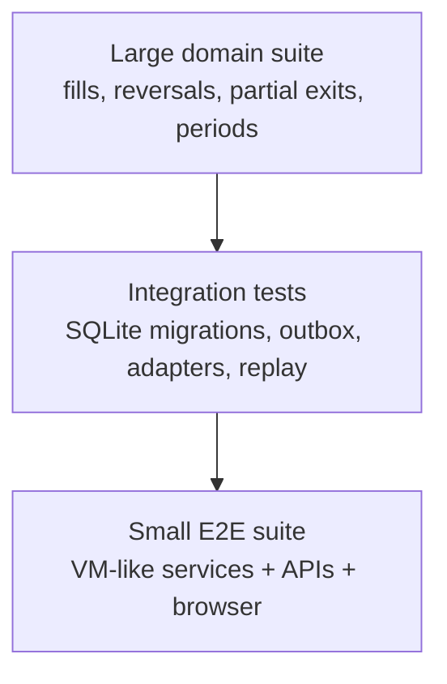

# Crypto Scientist Architecture Blueprint

Status: approved design; isolated phases 1 and the initial phase 2 foundation
are implemented and tested locally. No production cutover is active.

Last updated: 2026-07-30 (Asia/Calcutta)

Implementation workspace: `architecture_v2/`. All new architecture work stays
inside that subdirectory until an explicit, verified consumer cutover.

Implementation evidence and the current module map are in
`architecture_v2/docs/IMPLEMENTATION_STATUS.md`.

Migration strategy: incremental strangler replacement. Working exchange,
runtime, delivery, and presentation code is reused. See
`architecture_v2/docs/CURRENT_TO_V2_MIGRATION.md` for the current-module
classification and cutover seams.

## 1. High-level outcome

Crypto Scientist is a suite of independent applications connected by explicit,
one-way data contracts. The applications are linked from the App Hub, but they
do not share UI runtimes or write into each other's databases.



The central rule is:

> Raw execution facts are written once. Every number shown elsewhere is a
> versioned projection of those facts, never a new accounting entry.

## 2. Application boundaries

| Application | Owns | Reads | Must not own |
| --- | --- | --- | --- |
| Trade Tracker | exchange ingestion, raw executions, live positions, realized ledger, alert outbox | exchange APIs and its own database | journal notes, TVL alerts, market-signal decisions |
| Trade Journal | reasons, notes, tags, reviews, lifecycle links, journal settings | an idempotent projection of Tracker facts | exchange ingestion, Telegram trade alerts, TVL data |
| Signal Research | market signals, hypotheses, decisions, forward outcomes | market-signal sources | trade accounting, journal storage, TVL copies |
| TVL Monitor | protocol readings, TVL alerts, incident correlations | DeFi/protocol sources | trades, journal entries, market-signal decisions |
| App Hub | links, access metadata, shallow health | health endpoints | business data or background ingestion |

Physical databases:

```text
data/events.db             Trade Tracker only
data/trading_journal.db    Trade Journal only
data/command_center.db     Signal Research only
<TVL service state DB>     TVL Monitor only
data/portfolio.db          Private Portfolio Tracker only
```

No page-load endpoint performs ingestion or rebuilds derived state. A page load
is always a read.

## 3. Recommended truth model

### 3.1 Logical base per account, one physical ledger

Use one physical Tracker ledger with strict `account_id` partitioning rather
than one SQLite file per address.

Why:

- one transaction can commit a fill, cursor, realization, and outbox event;
- migrations and backups remain operationally simple;
- portfolio aggregation can query selected accounts consistently;
- adding/removing an account changes membership, not historical facts;
- account failure isolation belongs in source runtimes and checkpoints, not in
  separate database files.

Every ledger/projection key starts with `account_id`. A query without an
explicit account or portfolio scope is rejected below the repository layer.
Separate physical databases per account remain an optional future sharding
strategy, not an application-visible contract.

### 3.2 Layers of truth



Only L0/L1 are immutable source facts. L2-L4 are rebuildable, versioned
projections. Journal annotations are independent user-authored facts stored in
the Journal database.

### 3.3 Core identities

```text
account_id
  stable configured source ID, never a display name or secret

market_key
  exchange : venue_namespace : native_symbol

position_key
  account_id : market_key : position_side

execution_uid
  hash(account_id, venue, native_trade_id, execution_fragment)

lifecycle_uid
  deterministic identity of one flat-to-flat position run

realization_uid
  deterministic identity of the closing quantity of one execution

portfolio_id
  a named set of account memberships
```

Display names may change. Identities do not.

## 4. Accounting model

### 4.1 The two metrics are deliberately separate

| Metric | Time attribution | Unit counted | Purpose |
| --- | --- | --- | --- |
| Realized PnL | timestamp of each closing fill | realization fill | daily/weekly/monthly cash-flow truth |
| Trades closed | final flat/reversal timestamp | completed lifecycle | trade count and win-rate truth |
| Win rate | final flat/reversal timestamp | completed lifecycle | strategy outcome quality |
| Live unrealized PnL | latest authoritative position snapshot | open position | current exposure only |

Example:

```text
Jun 29  partial exit  +$395
Jul 02  partial exit  +$499
Jul 28  final close   +$126
```

- June realized PnL includes $395.
- July realized PnL includes $625.
- The lifecycle is counted as one closed winning trade on July 28.
- The Journal can display the whole lifecycle result of $1,020.
- The $1,020 lifecycle total is never inserted as another PnL ledger entry.

### 4.2 Period report contract

Every dashboard, Telegram command, recap, and export uses the same projector:

```text
AccountingPeriodReport
  scope:
    portfolio_id / account_ids
    start_at / end_at / timezone
    symbols / venues
  realized:
    pnl
    gross_profit
    gross_loss
    realization_count
    fees
    funding
    equity_curve_by_fill
  lifecycle:
    trades_closed
    wins
    losses
    win_rate
    profit_factor
    avg_win
    avg_loss
  live:
    unrealized_pnl
    open_positions
    notional
    snapshot_at
    freshness
  metadata:
    accounting_version
    projection_checkpoint
    incomplete_sources
```

This report prevents each consumer from inventing its own filtering and
grouping order.

### 4.3 Mandatory invariants

1. An `execution_uid` is ingested at most once.
2. A `realization_uid` contributes to realized PnL at most once.
3. `sum(period realization PnL) == all-time realization PnL` for a complete,
   non-overlapping partition of time.
4. A lifecycle contributes to `trades_closed` exactly once, when it becomes
   flat or reverses.
5. Lifecycle PnL equals the sum of its realization PnL, within a declared
   rounding tolerance.
6. A final dust close never moves earlier PnL into the final-close period.
7. An open lifecycle can have realized PnL from partial exits while contributing
   zero closed trades.
8. Failed/non-authoritative API responses never synthesize a close.
9. Removing an account from a portfolio never deletes its ledger history.
10. Journal edits never mutate Tracker accounting facts.

## 5. Target modules

```text
src/
  domain/
    identity.py             AccountKey, MarketKey, PositionKey
    executions.py           normalized immutable execution models
    accounting.py           realization and position-delta rules
    lifecycles.py           flat-to-flat lifecycle state machine
    reports.py              AccountingPeriodReport models

  adapters/
    hyperliquid.py
    lighter.py
    binance.py
    contracts.py            authoritative FetchResult contract

  application/
    ingest_execution.py     idempotent execution use case
    reconcile_positions.py  authoritative snapshot reconciliation
    project_account.py      one-account projector
    project_portfolio.py    composition only
    query_period.py         the single metrics handler
    publish_alert.py        transactional-outbox delivery

  infrastructure/
    tracker_repository.py
    migrations.py
    source_supervisor.py
    telegram_gateway.py

  web/
    tracker_api.py
    tracker_presenter.py

trade_journal/
  domain/
    annotations.py
  application/
    consume_tracker_feed.py
    edit_journal_entry.py
  infrastructure/
    journal_repository.py
  web/
    journal_api.py

command_center/
  ...signal-research-only modules...
```

Rules:

- domain modules do not import web, SQLite, Telegram, or exchange clients;
- application modules depend on repository/gateway interfaces;
- infrastructure implements those interfaces;
- web/Telegram layers format application results but never calculate PnL;
- `project_portfolio` only combines account projections; it does not reinterpret
  executions.

## 6. Data flow sequences

### 6.1 New fill ingestion



### 6.2 Partial exits and final close

```mermaid
sequenceDiagram
    participant F as Fill Stream
    participant A as Account Projector
    participant R as Realization Ledger
    participant L as Lifecycle Projection
    participant Q as Period Query

    F->>A: partial close at T1, PnL +100
    A->>R: append realization(T1, +100)
    A->>L: update lifecycle; status OPEN
    F->>A: final close at T2, PnL -10
    A->>R: append realization(T2, -10)
    A->>L: close lifecycle at T2; total +90
    Q->>R: period T2 query
    R-->>Q: realized PnL -10
    Q->>L: lifecycle closes in T2
    L-->>Q: 1 closed trade, 1 win
```

This apparently unusual result is correct: the period lost $10 on its fills,
while one profitable lifecycle completed in that period.

### 6.3 Dashboard/Telegram period query



### 6.4 Journal synchronization



Recommended single-VM transport: a durable Tracker outbox consumed
incrementally by the Journal. It is simpler than Kafka while preserving
idempotency, checkpoints, replay, and service ownership. Direct full-table scans
remain a temporary migration adapter only.

## 7. Storage design

Additive Tracker tables:

```text
accounts
portfolio_memberships
executions
realizations
position_snapshots
lifecycle_projections
lifecycle_realizations
projection_checkpoints
integration_outbox
notification_outbox
dead_letters
```

Important columns:

```text
executions
  execution_uid PK
  account_id
  market_key
  position_side
  native_trade_id
  occurred_at
  price
  quantity
  fee
  payload_hash

realizations
  realization_uid PK
  execution_uid
  account_id
  lifecycle_uid
  occurred_at
  closed_quantity
  gross_pnl
  fee
  funding
  net_pnl

lifecycle_projections
  lifecycle_uid PK
  account_id
  position_key
  opened_at
  closed_at nullable
  status
  entry_vwap
  exit_vwap
  max_size
  realized_pnl
  accounting_version

portfolio_memberships
  portfolio_id
  account_id
  active_from
  active_until nullable
  included
```

The existing `canonical_ledger_entries` table can serve as the compatibility
bridge. The normalized tables should become the final query contract because
important monetary columns should not live only inside JSON.

Journal database:

```text
external_lifecycles       read-model copy, stable external UID
external_executions       read-model copy, stable external UID
journal_entries           thesis, notes, rating, review status
journal_reasons
journal_entry_reasons
journal_sync_checkpoint
```

Foreign references use stable external UIDs, never Tracker row numbers.

## 8. APIs and ownership

Tracker query API:

```text
GET /api/v1/accounting/period
  ?portfolio_id=all
  &start=...
  &end=...
  &timezone=Asia/Kolkata
  &account_id=...
  &symbol=...

GET /api/v1/accounts
GET /api/v1/positions
GET /api/v1/lifecycles/{lifecycle_uid}
GET /api/v1/projection/status
```

Journal API:

```text
GET   /api/v1/journal
PATCH /api/v1/journal/{entry_id}
GET   /api/v1/reasons
POST  /api/v1/reasons
POST  /api/v1/sync
GET   /api/v1/sync/status
```

All report responses state their accounting version, checkpoint, time zone, and
incomplete/stale accounts.

## 9. Design choices

### Choice A: ledger plus projections, not recalculation in every consumer

Recommended. It centralizes rules, makes rebuilding possible, and makes
dashboard/Telegram parity testable.

### Choice B: logical account partitions, not one database file per wallet

Recommended for the current single VM. It provides the user's “one base per
address” as a strict logical boundary without multiplying migrations, backups,
connections, and partial-failure cases.

### Choice C: durable SQLite outbox, not a message broker

Recommended now. The workload is small, everything runs on one VM, and an
outbox provides replay and exactly-once effects without operating Kafka/Redis.
Move to a broker only if services later run across several machines or event
volume materially increases.

### Choice D: normalized monetary columns plus original payload

Recommended. Keep the raw exchange payload for audit, but store quantities,
fees, funding, and PnL in typed columns. JSON-only accounting is difficult to
constrain and reconcile.

### Choice E: projections are versioned and rebuildable

Recommended. Store `accounting_version` and projection checkpoints. A new
grouping rule can run in shadow mode and be compared with production before a
cutover.

### Choice F: explicit timezone in every period query

Recommended. Telegram “today” in IST and UTC daily jobs otherwise create
different numbers. A report never relies on the server's implicit timezone.

## 10. Implementation plan

### Phase 0 — Freeze and baseline

1. Stop architecture-changing edits.
2. Back up all VM databases and deployed code.
3. Record hashes, row counts, schema, integrity checks, and per-account/symbol/
   day PnL baselines.
4. Create a permanent regression fixture for `XYZ:MU` and other partial exits.

Exit gate: backups restore successfully and baseline reports are reproducible.

### Phase 1 — Contracts and pure domain engine

Status: complete locally with automated tests.

1. Add typed execution, realization, lifecycle, and report models.
2. Implement one-account projection as pure functions.
3. Implement portfolio composition without regrouping.
4. Implement `AccountingPeriodReport`.
5. Encode every invariant as tests.

Exit gate: all historical fixtures pass; period totals partition without double
counting.

### Phase 2 — Additive normalized storage

Status: the isolated V2 schema, repository, memberships, checkpoint, and outbox
foundation are complete locally. Production backfill and reconciliation have
not started.

1. Add v2 tables without removing current tables.
2. Backfill stable account/execution/realization/lifecycle UIDs.
3. Mark ambiguous legacy records instead of guessing.
4. Reconcile old totals against v2 by account, symbol, and day.

Exit gate: unexplained PnL difference is zero; every exception is documented.

### Phase 3 — Shadow projection

Status: a read-only metric comparison contract and projection invariant
evaluator are complete locally. Continuous production shadow projection has not
started.

1. Keep existing production reads.
2. Write/project v2 in parallel.
3. Compare old and new reports continuously.
4. Classify differences as fixed defects, expected attribution changes, or
   unresolved blockers.

Exit gate: no unexplained differences for an agreed observation window.

### Phase 4 — Consumer cutover

Cut over one at a time:

1. Trade Tracker dashboard.
2. Telegram `/pnl`, `/today`, `/weekly`, `/coin`, `/leaderboard`, `/stats`.
3. Daily recap.
4. Trade Journal projection feed.

Exit gate for each consumer: it renders the same versioned report for the same
query and fixture.

### Phase 5 — Journal decoupling

1. Replace full Tracker-table scans with incremental outbox consumption.
2. Move shared store/ingestor code behind Journal-owned interfaces.
3. Verify Journal downtime does not affect Tracker.
4. Verify replay preserves reasons, notes, and links.

Exit gate: each application writes only its database.

### Phase 6 — Cleanup and deployment

1. Remove old per-consumer PnL calculations after a rollback window.
2. Keep compatibility views for one release.
3. Back up VM again.
4. Deploy with automatic rollback.
5. Run production smoke, accounting, alert-volume, and read-only page-load
   checks.
6. Pull a new explicit VM snapshot to local and update provenance.

## 11. Test strategy

Test pyramid:



Required scenario matrix:

- single fill open and full close;
- multiple fills inside batching threshold;
- scale-in;
- several partial exits across days/weeks/months;
- final dust close;
- open lifecycle with realized partial profit;
- profitable lifecycle whose final fill loses money;
- losing lifecycle whose final fill profits;
- long/short reversal in one execution;
- same symbol on two accounts;
- same native trade ID on two accounts;
- duplicate and out-of-order fills;
- restart and replay;
- failed/non-authoritative empty API response;
- account added/removed from portfolio;
- unknown PnL, fees, funding, and rounding;
- IST “today” boundary and daylight-independent UTC handling.

Human-like evaluation checklist:

1. Can a reviewer trace every displayed dollar to realization UIDs?
2. Can a reviewer explain why closed-trade PnL and period realized PnL differ?
3. Does a partial exit appear in the correct day even while the trade is open?
4. Does closing the final $1 avoid replaying the earlier $20,000 result?
5. Do dashboard and Telegram show identical totals for identical filters?
6. Does reloading a page create zero writes/sync runs?
7. Does disabling one account preserve all other accounts and history?
8. Are stale/incomplete sources clearly disclosed rather than silently zeroed?

## 12. Observability and operations

Expose:

- last authoritative fill/checkpoint per account;
- projection lag and accounting version;
- outbox queue depth and oldest pending age;
- duplicate count and dead-letter count;
- report freshness and incomplete sources;
- alert sent/suppressed/retried counts;
- Journal consumer checkpoint;
- zero page-load writes.

Every deployment produces:

```text
backup path
code commit/hash
database hashes and integrity results
migration version
old-vs-new accounting comparison
test counts
service health
rollback command
post-deploy VM snapshot provenance
```

## 13. Definition of done

The architecture is complete when:

- each execution is ingested once and is traceable end to end;
- all period PnL comes from fill-time realizations;
- trade counts and win rate come only from lifecycle closes;
- all consumers use one versioned report handler;
- account projections compose without cross-account grouping;
- Journal, Signal Research, TVL Monitor, and Tracker have separate databases and
  writer ownership;
- page loads are read-only;
- partial exits, final dust closes, reversals, replay, and account membership
  pass automated and human-like evaluations;
- the release is backed up, deployed, production-verified, and locally
  snapshotted.

## 14. Trade execution chart extension

Lifecycle PnL cards will be paired with a trade-specific execution chart. The
chart uses authoritative fills, bounded candle context, buy/sell markers,
partial-exit/reversal semantics, one shared static/interactive chart contract,
and idempotent Telegram album delivery. The researched design is in
`architecture_v2/docs/EXECUTION_CHART_DESIGN.md`.
