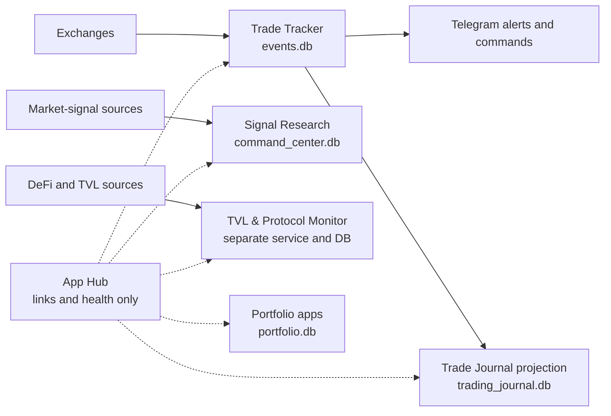

# Crypto Scientist

Crypto Scientist is a suite of independent trading, research, portfolio, and
risk applications. They can be launched together and discovered through one App
Hub, but each application keeps a clear runtime and data boundary.

This repository contains the production Trade Tracker, Trade Journal, Signal
Research app, portfolio tools, PnL analytics, App Hub, deployment definitions,
tests, and the isolated V2 accounting architecture workspace.

## What is currently implemented

The current release includes:

- multi-account Trade Tracker ingestion for supported Hyperliquid, Lighter, and
  Binance sources;
- live positions, open orders, fills, alerts, health, account filters, sorting,
  and filter-aware aggregate unrealized PnL;
- a filter-aware dashboard summary that shows one Current uPnL total rather
  than redundant Long/Short uPnL cards; side analysis remains available through
  the Direction filter and Telegram command filters;
- idempotent execution and alert handling designed to suppress reconnect and
  historical-backfill spam;
- position-level realization recording with partial/full close information;
- Telegram commands for private and community use, with separate discussion
  reply behavior and owner permissions;
- standalone Trade Journal with lifecycle reconstruction, execution batching,
  active/closed states, reasons, notes, editing, filters, and sortable columns;
- standalone Signal Research app for market signals, hypotheses, forward
  outcomes, and weekly edge review;
- standalone TVL & Protocol Monitor integration through the App Hub without
  copying its database into Signal Research or the Journal;
- a public professional portfolio and downloadable trading-systems pitch deck,
  linked as **Naga Portfolio** from the App Hub;
- guest and private portfolio applications;
- an explicit VM-to-local snapshot workflow with integrity checks and
  provenance;
- GCP systemd and nginx definitions for the separated applications.

The detailed request history, production state, verification evidence, and
rollback records are maintained in
[`PROJECT_LEDGER.md`](PROJECT_LEDGER.md).

## Current architecture



Important boundaries:

- Trade Tracker owns exchange ingestion, live positions, trade accounting, and
  Telegram delivery.
- Trade Journal owns reasons, notes, reviews, and its journal database.
- Signal Research owns market signals and their evaluated outcomes.
- TVL Monitor owns protocol/TVL readings and alerts.
- App Hub owns no business data; it provides links and shallow health checks.
- Page-load/bootstrap endpoints are read-only. Background workers or explicit
  **Sync now** actions perform synchronization.
- The production VM is authoritative. Local databases are explicit snapshots,
  not a second production state.

The target end-to-end design is documented in
[`ARCHITECTURE_BLUEPRINT.md`](ARCHITECTURE_BLUEPRINT.md).

## V2 architecture workspace

All new accounting-architecture work is isolated in
[`architecture_v2/`](architecture_v2/README.md). It is an incremental migration,
not a full rewrite.

The V2 plan:

1. preserve working exchange clients, source loading, supervision, UI,
   Telegram transport, and health;
2. introduce immutable executions and one account projector per account;
3. compose account projections through one portfolio handler;
4. report realized PnL by realization-fill time;
5. report trades closed and win rate by lifecycle-close time;
6. run current and V2 outputs in shadow comparison;
7. switch dashboard, Telegram, recaps, and Journal feeds one at a time;
8. retain rollback paths until the comparison window is complete.

The current-to-V2 module map is in
[`architecture_v2/docs/CURRENT_TO_V2_MIGRATION.md`](architecture_v2/docs/CURRENT_TO_V2_MIGRATION.md).

The planned PnL-card execution chart—candles plus buy, sell, entry, scale,
partial-exit, reversal, and close markers—is described in
[`architecture_v2/docs/EXECUTION_CHART_DESIGN.md`](architecture_v2/docs/EXECUTION_CHART_DESIGN.md).

The exchange-style chart is an optional presentation plugin. It is enabled by
default when Plotly/Kaleido are installed; set `CHART_STYLE=classic` (or
`CHART_STYLE=off`) to unplug it and keep the deterministic Pillow chart. Set
`CHART_RENDERER=pillow` to force the same fallback independently of style.
The plug-in changes presentation only—fills, PnL, Telegram delivery, and
accounting remain untouched.

V2 now has a locally implemented, isolated foundation: immutable executions,
per-account projection, portfolio composition, fill-time and lifecycle-close
reporting, additive SQLite storage, checkpoints/outbox, a runtime adapter,
shared execution-chart specifications, a deterministic PNG renderer, and
projection/shadow evaluators. It has **not** replaced production accounting,
been connected to production databases, or been enabled for a production
consumer. Commit `fb229f7` is installed on the VM as inert source for
inspection and testing; it ran no migrations and restarted no services. The
exact status and next gates are in
[`architecture_v2/docs/IMPLEMENTATION_STATUS.md`](architecture_v2/docs/IMPLEMENTATION_STATUS.md).

## Applications and local ports

| Application | Package/command | Port |
| --- | --- | ---: |
| Trade Tracker | `python -B -m src.dashboard` | 8080 |
| Signal Research | `python -B -m command_center.app` | 8810 |
| Trade Journal | `python -B -m trade_journal.app` | 8811 |
| App Hub | `python -B -m apps_hub.access_page` | 8800 |
| Portfolio Overview | `python -B -m src.portfolio_app` | 8790 |
| Private Portfolio | `python -B -m src.portfolio_app --storage-mode private --port 8791` | 8791 |
| Standalone PnL Analytics | `python -B -m standalone.pnl_analytics_bot.dashboard.server` | 8787 |
| TVL & Protocol Monitor | sibling `hack-alert-bot` project | 8788 |

Some App Hub links describe optional sibling or separately deployed
applications. An unavailable optional application appears offline without
preventing this repository's core applications from starting.

## Requirements

- Python 3.11 or newer recommended
- PowerShell on Windows or Bash on Linux
- network access for live exchange/API integrations
- read-only credentials only where an exchange requires authentication
- Google Cloud CLI only for VM snapshot/deployment operations

## Setup

### Windows PowerShell

```powershell
cd "D:\content\crypto scientist\lighter-trade-bot"
py -m venv .venv
& ".\.venv\Scripts\python.exe" -m pip install --upgrade pip
& ".\.venv\Scripts\python.exe" -m pip install -r requirements-dev.txt
Copy-Item .env.example .env
```

Edit `.env` with the accounts and integrations you actually use. Never commit
`.env`, wallet secrets, API secrets, Telegram tokens, or private keys.

Review `config.example.yaml`, then update the local `config.yaml` source entries
and non-secret behavior settings. Secrets should be referenced through
environment variables.

### Linux

```bash
cd /path/to/lighter-trade-bot
python3 -m venv .venv
. .venv/bin/activate
python -m pip install --upgrade pip
python -m pip install -r requirements-dev.txt
cp .env.example .env
```

## Run all local applications

Windows:

```powershell
& ".\apps_hub\run_all_apps.ps1" -Python ".\.venv\Scripts\python.exe"
```

Linux:

```bash
PYTHON_BIN=.venv/bin/python ./apps_hub/run_all_apps.sh
```

Open the App Hub at <http://127.0.0.1:8800/>.

The launchers:

- start only applications whose ports are not already occupied;
- write logs to `data/app_logs/`;
- keep databases and logs local and ignored by Git;
- stop the processes they started when the launcher exits.

## Run one application

Examples:

```powershell
# Trade Tracker
& ".\.venv\Scripts\python.exe" -B -m src.dashboard

# Signal Research
& ".\.venv\Scripts\python.exe" -B -m command_center.app --host 127.0.0.1 --port 8810

# Trade Journal
& ".\.venv\Scripts\python.exe" -B -m trade_journal.app --host 127.0.0.1 --port 8811

# App Hub
& ".\.venv\Scripts\python.exe" -B -m apps_hub.access_page --host 127.0.0.1 --port 8800
```

Trade Journal and Signal Research read their bootstrap state without running a
full workspace ingestion on every browser refresh. Their background workers and
explicit `/api/sync` actions own refresh behavior.

## Test

Run the full suite:

```powershell
& ".\.venv\Scripts\python.exe" -m pytest -q --basetemp data/pytest-tmp
```

Or with an activated environment:

```bash
python -m pytest -q --basetemp data/pytest-tmp
```

Focused examples:

```bash
python -m pytest -q tests/test_canonical_pnl.py
python -m pytest -q tests/test_trade_journal.py
python -m pytest -q tests/test_command_center.py
python -m pytest -q tests/test_telegram_commands.py
python -m pytest -q architecture_v2/tests
```

Accounting changes must include regression fixtures for partial exits, final
dust closes, reversals, duplicate fills, time boundaries, and multiple
accounts. Dashboard and Telegram totals must be verified against the same input
and accounting version. The default test configuration discovers both
`tests/` and `architecture_v2/tests/`.

## Production state and local snapshots

Production databases live on the VM. To refresh local state explicitly:

```powershell
& ".\scripts\sync_vm_state.ps1"
```

The synchronization workflow:

1. resolves the configured VM/project;
2. snapshots the remote SQLite databases;
3. checks integrity;
4. backs up the previous local copies;
5. downloads the VM snapshots;
6. records hashes and provenance in `.vm-state/current.json`.

`.vm-state/`, `.local-backups/`, `.deploy/`, databases, logs, generated cards,
and `.env` are intentionally ignored by Git.

Do not silently upload local databases to production. Deployment and migration
work must take a fresh VM backup, verify schema/data totals, provide rollback,
and pull a new production snapshot after validation.

## Repository guide

```text
src/                    Trade Tracker, portfolio tools, adapters, persistence
trade_journal/          standalone Journal web app
command_center/         standalone Signal Research app
apps_hub/               app directory and local launchers
standalone/             standalone analytics tools
architecture_v2/        isolated next-architecture workspace
tests/                  repository regression and integration tests
deploy/gcp/             systemd, nginx, and VM runbooks
scripts/                validation, migration, analysis, and VM sync tools
data/                   local runtime state; databases/logs are ignored
```

## Documentation rule for every change

Every functional commit or deployment must update documentation in the same
change:

1. update **What is currently implemented** when user-visible behavior changes;
2. update setup/run/test instructions when commands, ports, configuration, or
   dependencies change;
3. update `PROJECT_LEDGER.md` with the request, architectural decision,
   verification evidence, deployment status, backups, and rollback information;
4. update the relevant package README for application-specific behavior;
5. state clearly whether work is design-only, implemented locally, tested,
   deployed, or rolled back;
6. never include secrets, private runtime state, raw production databases, or
   generated deployment archives.

This rule is part of the project workflow, not an optional cleanup step.

## Security

- Use read-only exchange API credentials wherever possible.
- Keep secrets exclusively in ignored environment files or the VM secret
  environment.
- Do not expose wallet addresses, credential values, tokens, or source payloads
  through public health endpoints.
- Treat public pool IDs and public wallet addresses as sensitive operational
  metadata even when they are not signing secrets.
- Review staged changes before every push.

## More documentation

- [`PROJECT_LEDGER.md`](PROJECT_LEDGER.md) — living project and deployment record
- [`ARCHITECTURE_BLUEPRINT.md`](ARCHITECTURE_BLUEPRINT.md) — target architecture
- [`APP_LAUNCHER.md`](APP_LAUNCHER.md) — local launcher reference
- [`PROCESS.md`](PROCESS.md) — operating and delivery process
- [`TRADE_TRACKER_MULTI_ACCOUNT_REVAMP_PLAN.md`](TRADE_TRACKER_MULTI_ACCOUNT_REVAMP_PLAN.md) — multi-account design history
- [`deploy/gcp/`](deploy/gcp/) — VM service definitions and deployment notes
