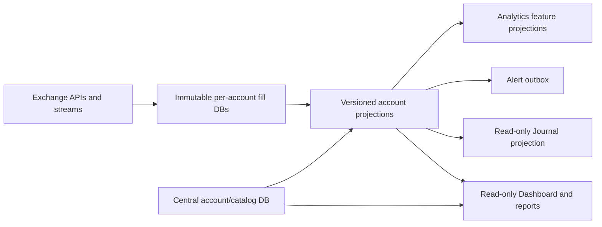

# Crypto Scientist Architecture Decisions — 2026-08-04

Status: architecture-only decision record. No runtime code, production schema,
consumer cutover, or deployment is authorized by this document.

This record resolves the remaining ambiguity between the original V2 blueprint,
the per-account ledger work, the June 1 reporting policy, and the lifecycle
analytics requirements.

## 1. Ownership and source of truth

The exchange is the source of truth for fills and position snapshots. The
system stores those facts immutably and rebuilds all accounting and analytics
from them.



There are two storage roles:

1. **One immutable ledger database per account.** It contains exchange fills,
   fill observations, source metadata, and rebuildable account-local
   projections. A raw fill is never edited or deleted as part of a normal
   repair.
2. **One central catalog database.** It contains the account registry, label
   history, portfolio memberships, physical-ledger manifest, projection
   checkpoints, comparison evidence, and cross-account query metadata. It does
   not become a second copy of the exchange-fill ledger.

This supersedes the older “one logical database is preferred” wording in the
blueprint. Logical account isolation remains mandatory even when a deployment
temporarily hosts multiple ledgers in one SQLite file for operational reasons.

## 2. Account identity, labels, and lifecycle state

`account_id` is permanent and machine-owned. It is never derived from a display
name, wallet label, row number, or secret. Display names are presentation data.

The catalog must maintain these separate concepts:

| Concept | Meaning | Can change without changing history? |
| --- | --- | --- |
| `account_id` | Stable source identity | No |
| `exchange` / venue namespace | Execution venue identity | No, except a corrected configuration record |
| `display_label` | Human-facing name such as “HL Swing Wallet” | Yes |
| `ingestion_enabled` | Whether new exchange facts are collected | Yes |
| `alerts_enabled` | Whether live events may enter the notification outbox | Yes |
| `portfolio_included` | Whether the account contributes to a selected portfolio | Yes |
| `historical_visible` | Whether prior facts are returned by history/analytics queries | Yes |

Account labels require valid-time history:

```text
account_labels(
  account_id,
  label,
  valid_from,
  valid_until,
  changed_by,
  change_reason
)
```

Renaming `HL` to `HL Swing Wallet` changes the label projection only. It must
not create a new account, split a lifecycle, or change a source-scoped UID.

Removing the NK pool from active configuration means, by default:

- `ingestion_enabled = false`;
- `alerts_enabled = false`;
- `portfolio_included` remains an explicit portfolio decision;
- `historical_visible` remains true unless deliberately changed.

This prevents a configuration cleanup from silently deleting or hiding old
PnL.

## 3. Immutable ledger and projection boundaries

### Immutable account ledger

```text
exchange_fills
  fill_uid PK
  account_id
  exchange
  venue_namespace
  native_trade_id
  occurred_at
  observed_at
  side
  position_side
  market_key
  quantity
  price
  fee
  funding
  realized_pnl_exchange
  raw_payload
  payload_hash

fill_observations
  observation_uid PK
  fill_uid FK
  observed_at
  payload_hash
  raw_payload
```

`fill_observations` records a changed response from an exchange without
rewriting the original fill. A correction is represented as a new observation
and resolved by a documented projection policy.

### Rebuildable projections

```text
realizations
  realization_uid PK
  execution_uid
  lifecycle_uid
  occurred_at
  quantity
  exchange_pnl
  calculated_pnl
  net_pnl
  pnl_basis
  projection_version

lifecycles
  lifecycle_uid PK
  account_id
  market_key
  position_side
  opened_at
  closed_at nullable
  status
  entry_vwap
  exit_vwap
  realized_pnl
  holding_duration_ms nullable
  holding_duration_basis
  projection_version

lifecycle_features
  lifecycle_uid PK
  feature_version
  first_reduce_at nullable
  time_to_first_reduce_ms nullable
  increase_count
  reduction_count
  max_quantity
  max_notional
  mfe nullable
  mae nullable
  pnl_per_hour nullable
  completeness
  basis_json
```

Core accounting facts and optional analytics features remain separate. A
missing candle or mark must produce an explicit incomplete feature, not a
fabricated value.

## 4. Holding-time contract

`opened_at` and `closed_at` are lifecycle boundaries. Holding time is not a
fill-level property and is not reset by scale-ins or partial exits.

```text
closed/reversed lifecycle:
  holding_duration_ms = max(0, closed_at - opened_at)
  holding_duration_basis = exact | inferred_lower_bound

open lifecycle:
  holding_duration_ms = NULL in storage
  holding_as_of = query timestamp
  display duration = holding_as_of - opened_at
```

The database stores integer milliseconds for analysis; the UI may format the
value as `12m`, `2h 14m`, or `3d 6h`. The formatted string is never the
analytical source field.

## 5. Cutoff and context policy

The reporting cutoff remains:

```text
report_start = 2026-06-01T00:00:00Z
```

Every projection/report request must carry two distinct windows:

```text
context_start  = earliest fill allowed to reconstruct state
report_start   = first event eligible for displayed PnL/metrics
report_end     = exclusive report boundary, if present
as_of          = time at which live state and freshness are evaluated
timezone       = presentation/report timezone
```

Context fills may establish an entry position, cost basis, lifecycle start, or
holding-time lower bound. They may not create report-period PnL, trade counts,
alerts, or visible realization rows before `report_start`.

All report payloads must expose the policy ID, boundaries, accounting version,
projection checkpoint, and incomplete-account list.

## 6. Live, backfill, repair, and shadow runs

Every projection run has an explicit mode:

```text
LIVE      exchange stream/poll; alerts may be emitted through the outbox
BACKFILL  historical import; no alerts
REPAIR    replace derived rows in a declared window; no alerts
SHADOW    compare against another projection; no consumer writes or alerts
```

Alert suppression is an architectural boundary: only `LIVE` may create a
notification-outbox record. A caller cannot accidentally turn a backfill into a
live alert run by omitting a flag.

Each run records:

```text
run_id
mode
input_snapshot_hash
account_ids
context_start
report_start
report_end
accounting_version
projection_hash
started_at
finished_at
rows_read
rows_written
alerts_created
status
```

Expected invariant: `alerts_created = 0` for BACKFILL, REPAIR, and SHADOW.

## 7. Deterministic shadow comparison

Before a consumer cutover, the legacy and V2 projectors run from the same
immutable snapshot. Comparison is persisted, not just printed to a log.

Comparison dimensions:

- account;
- symbol/market key;
- UTC day;
- lifecycle UID or declared lifecycle mapping;
- realization UID;
- report window.

Each difference is classified as:

```text
MATCH
EXPECTED_IDENTITY_REKEY
EXPECTED_CUTOFF_POLICY
EXPECTED_PNL_BASIS
UNEXPLAINED
```

Cutover requires zero `UNEXPLAINED` differences, stable projection hashes on
replay, no new alert-outbox rows from shadow execution, and successful
invariant evaluation.

## 8. Journal and Dashboard ownership

The Tracker/accounting projection owns:

- executions;
- realizations;
- lifecycles;
- holding time;
- realized/live PnL;
- mark provenance and freshness.

The Journal owns:

- notes;
- reasons;
- tags;
- review status;
- user-authored annotations.

Journal links use immutable external UIDs. They never use physical row IDs and
must survive a projection rebuild or lifecycle re-key through an explicit
`lifecycle_lineage` mapping.

The Dashboard and Journal read the same report/lifecycle contracts. Neither
recalculates PnL or groups fills independently.

## 9. Migration, backup, and rollback gates

### Before migration

- freeze the target snapshot hash;
- create consistent per-account ledger backups;
- record SQLite integrity, schema version, row counts, and projection hashes;
- run migration dry-run and verify expected table/column changes;
- validate restore into a temporary database.

### During migration

- append or replace only derived projections;
- never rewrite or delete immutable exchange fills;
- run in `REPAIR` or `SHADOW` mode;
- require an explicit report window and accounting version;
- prevent notification-outbox writes.

### After migration

- rerun integrity checks;
- compare counts, hashes, PnL, lifecycle totals, holding-time values, and
  membership state;
- verify alert-outbox delta is zero for non-live runs;
- verify read-only Dashboard/Journal endpoints;
- store the evidence bundle beside the backup.

### Rollback

Rollback is projection/version selection plus consumer feature-flag reversal.
Immutable fills are not rolled back. A rollback package must contain the prior
projection hash, schema manifest, source hash, service state, and database
integrity results.

## 10. Recommended rollout sequence

1. Ratify this decision record and update the older blueprint language.
2. Add the central catalog contract and label/state history.
3. Add the two-boundary cutoff and run-mode contract.
4. Add versioned lifecycle feature definitions and completeness rules.
5. Persist shadow-run evidence and deterministic projection hashes.
6. Generate anonymized fixtures from the VM snapshot.
7. Run account/symbol/day/lifecycle comparisons until all differences are
   classified.
8. Expose read-only report endpoints to Journal and Dashboard.
9. Approve consumer cutovers individually, with backup and rollback evidence.

No Telegram, dashboard, Journal, or exchange-ingestion cutover is implied by
this architecture document.
