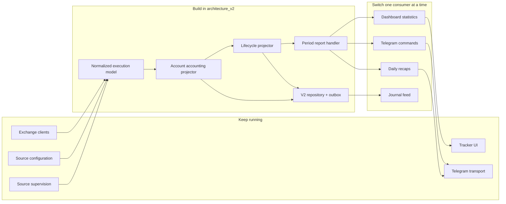
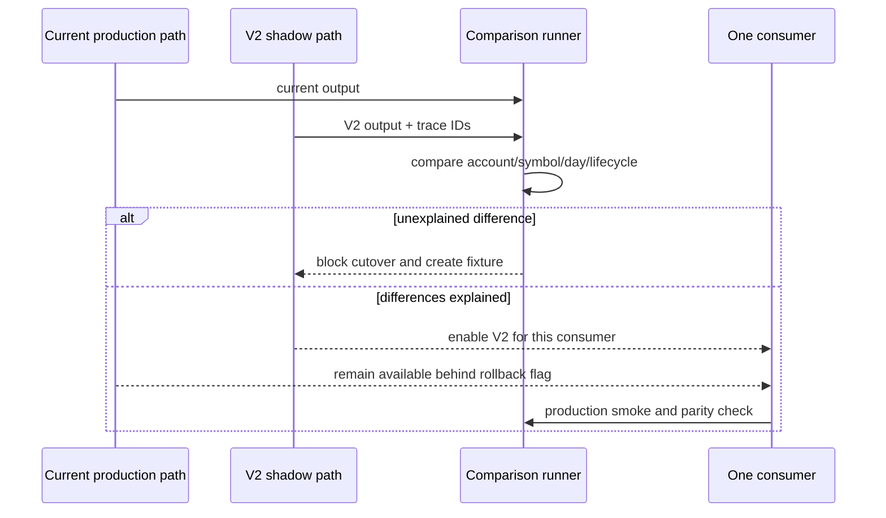

# Current-to-V2 Migration Map

Status: migration design with first isolated implementation slice complete

The redesign is not a full rewrite. It is a staged replacement of the
accounting path while preserving working ingestion, supervision, delivery, and
presentation code.

## 1. What changes and what stays



## 2. Current module classification

| Current module | Decision | Reason and V2 treatment |
| --- | --- | --- |
| `src/hyperliquid_client.py` | Reuse behind adapter | Existing API integration and recovery logic remain valuable. Normalize its output at a V2 boundary. |
| `src/lighter_client.py` | Reuse behind adapter | Preserve working REST/WS behavior; translate fills into V2 execution contracts. |
| `src/binance_client.py` | Reuse behind adapter | Preserve transport/authentication; strengthen identity and authoritative-result handling separately. |
| `src/sources.py` | Reuse, then narrow | Stable source IDs and configuration already exist. V2 consumes a small immutable account specification. |
| `src/source_runtime.py` | Reuse | Per-source runtime state remains outside accounting. |
| `src/supervisor.py` | Reuse | Failure isolation and restart supervision are operational concerns, not accounting concerns. |
| `src/types.py` | Wrap | Current mutable/runtime types continue at the edge. V2 gets immutable domain types and explicit conversion. |
| `src/position_tracker.py` | Refactor gradually | Current fill classifier remains until V2 account projector proves parity. It is then replaced only in the write path. |
| `src/db.py` | Keep as compatibility repository | Existing tables and functions remain during shadow mode. Additive V2 migrations/repositories are separate. |
| `src/canonical_pnl.py` | Mine and supersede incrementally | Stable account membership and composition concepts are retained. JSON-only ledger and presentation-shaped projections are replaced by typed V2 tables/contracts. |
| `src/stats.py` | Split | Generic formatting can stay. Round-trip and period accounting move into the V2 domain/query handler. |
| `src/dashboard.py` | Keep UI/runtime; extract seams | Do not rewrite the large dashboard. Replace direct PnL calculations with one injected/query function, then extract other responsibilities over time. |
| `src/telegram_commands.py` | Reuse formatting | Commands receive `AccountingPeriodReport`; they stop calculating or filtering accounting rows. |
| `src/notifier.py` | Reuse | Transport stays unchanged; semantic alert creation moves behind the outbox/use-case boundary. |
| `src/formatter.py` | Reuse presentation logic | It formats domain/application results but does not own accounting. |
| `src/pnl_card.py` | Reuse with a new input DTO | Card rendering remains presentation-only. |
| `src/stats_card.py` | Reuse with label changes | It renders realized-fill and lifecycle-close fields explicitly. |
| `command_center/lifecycles.py` | Port rules, do not keep ownership | Valuable reconstruction rules move into the V2 pure lifecycle projector with existing regressions. Signal Research must not remain the owner of trade lifecycles. |
| `command_center/ingest.py` | Split and retire trading scan | Signal ingestion stays. `_trades`, `_lifecycles`, and `_positions` are removed after Journal consumes the Tracker outbox. |
| `command_center/store.py` | Split ownership | Signal tables remain with Signal Research. Journal storage becomes Journal-owned and no longer attaches/duplicates the Command Center database. |
| `trade_journal/app.py` | Keep web/UI, replace backend dependency | Preserve routes and frontend where useful. Replace `CommandStore`/`WorkspaceIngestor` imports with Journal-owned repository and feed consumer interfaces. |
| `command_center/app.py` | Keep | It remains the Signal Research application only. |
| `apps_hub/access_page.py` | Reuse unchanged | Links and health remain separate from all accounting. |

## 3. Estimated change footprint

The goal is to avoid touching unrelated working code.

### New code

Most new code lives under:

```text
architecture_v2/domain/
architecture_v2/application/
architecture_v2/adapters/
architecture_v2/infrastructure/
architecture_v2/migrations/
architecture_v2/tests/
```

### Small integration changes later

After shadow verification, expected production edits are limited to:

```text
src/dashboard.py
  call V2 query handler for stats/recaps/Telegram accounting

src/telegram_commands.py
  accept and label the new report contract

src/stats_card.py
  distinguish realized PnL from closed-trade metrics

src/db.py
  initialize additive schema or delegate to V2 repository

trade_journal/app.py
  use Journal-owned repository/feed consumer

deploy/gcp/*.service
  add explicit paths/version flags only if required
```

Exchange clients, most UI rendering, access control, health, source loading,
Telegram delivery, and unrelated apps do not need a rewrite.

## 4. Integration seams

### Seam A — runtime fill to immutable execution

```python
execution = execution_adapter.normalize(source, runtime_trade)
result = ingest_execution.handle(execution)
```

This is inserted after exchange parsing and before accounting persistence.
Existing alerts/rows continue in parallel during shadow mode.

### Seam B — one period query

```python
report = accounting_queries.period(
    portfolio_id="all",
    start_at=start,
    end_at=end,
    timezone="Asia/Kolkata",
    account_ids=filters.accounts,
    symbols=filters.symbols,
)
```

The dashboard, `/today`, `/weekly`, `/pnl`, `/coin`, leaderboard, stats card,
and recap all receive this same report.

### Seam C — Journal projection feed

```python
batch = tracker_feed.after(journal_checkpoint, limit=500)
journal_projection.apply(batch)
journal_checkpoint.commit(batch.last_sequence)
```

Journal annotations remain in place because external lifecycle facts and
user-authored journal entries are different tables.

## 5. Cutover sequence



Recommended order:

1. Read-only internal comparison endpoint.
2. Dashboard analytics.
3. Telegram period commands.
4. Daily recap.
5. Journal projection synchronization.
6. Execution write-path cutover only after all read consumers are stable.
7. Retire old calculations after the rollback window.

## 6. Feature flags

Use explicit flags during migration:

```text
V2_SHADOW_WRITES=true
V2_ACCOUNTING_READS=false
V2_JOURNAL_FEED=false
V2_COMPARE_REPORTS=true
```

Flags are changed one capability at a time. A single master “rewrite on/off”
flag is avoided because it makes rollback and diagnosis too coarse.

## 7. What must not happen

- No big-bang replacement of `src/dashboard.py`.
- No rewrite of exchange clients merely to fit a new folder structure.
- No copying production databases into the V2 directory and treating them as a
  second live state.
- No dual writers for the same accounting fact after cutover.
- No lifecycle total inserted into the realization ledger.
- No consumer-specific date filtering before/after grouping.
- No removal of old tables until the rollback release expires.

## 8. First implementation slice

The first slice is deliberately small and pure:

1. identity and money/time models;
2. immutable execution and realization models;
3. one-account position/lifecycle projector;
4. period report projector;
5. fixtures for partial exit, final dust close, and reversal;
6. tests only—no production imports, database writes, or deployment.

This slice is now implemented. The isolated additive storage repository,
runtime-shape adapter, chart contract/renderer, projection evaluator, and
generic read-only shadow comparator are also implemented. Production backfill,
continuous shadow execution, consumer imports, and deployment remain gated.
See `IMPLEMENTATION_STATUS.md`.
