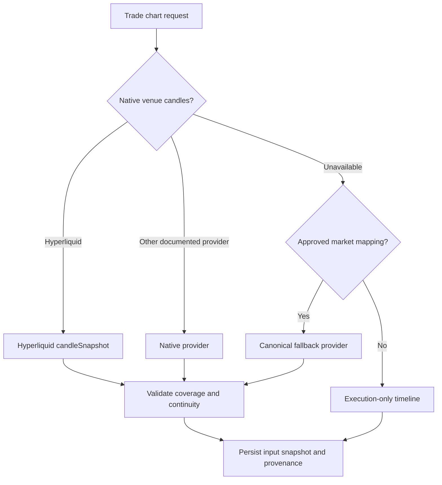
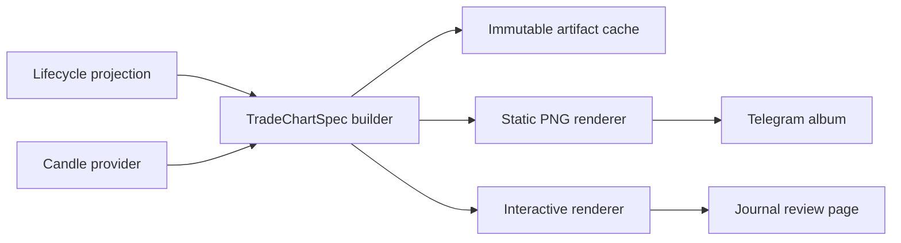

# Trade Execution Chart and PnL Card Design

Status: shared contract, interval selection, marker batching, and deterministic
static PNG renderer implemented locally; provider/delivery integrations pending

Last updated: 2026-07-30

## 1. Desired experience

When a lifecycle PnL card is sent, Telegram receives an album:

1. the existing summary/PnL card;
2. a trade-specific candlestick chart with every entry, scale, partial exit,
   reversal leg, and final close plotted at its actual execution time and price.

The Trade Journal shows the same chart interactively. Clicking a marker reveals
the raw fills in that execution batch.

The static Telegram chart and interactive Journal chart are generated from the
same immutable `TradeChartSpec`, so they cannot disagree about fills.

## 2. What established products do

### TradingView

TradingView's execution marks place buy/sell arrows at exact execution points
and automatically group dense executions. Labels can be hidden for a cleaner
chart. Its API also exposes immutable execution drawings for trading history.

Sources:

- [Execution marks](https://www.tradingview.com/support/solutions/43000763371-execution-marks/)
- [Execution drawings API](https://www.tradingview.com/charting-library-docs/latest/ui_elements/drawings/drawings-api/)
- [Chart marks](https://www.tradingview.com/charting-library-docs/latest/ui_elements/Marks/)

### Hyperliquid

Hyperliquid exposes the two facts needed to recreate this accurately:

- user fills, including aggregation of partial matches by time;
- native candle snapshots for a requested symbol, interval, and time range,
  including HIP-3 symbols with their DEX prefix.

Recent fill and candle history is bounded, so completed chart inputs should be
cached instead of depending on indefinite API availability.

Sources:

- [Hyperliquid user fills and candle snapshots](https://hyperliquid.gitbook.io/hyperliquid-docs/for-developers/api/info-endpoint)
- [Hyperliquid API rate limits](https://hyperliquid.gitbook.io/hyperliquid-docs/for-developers/api/rate-limits-and-user-limits)

### Lighter

Lighter documents account trade streams, including all-account trades and
per-market account data. The currently documented public API reviewed does not
provide an equivalent candle-snapshot contract.

Therefore:

- execution markers come from authoritative Lighter account trades;
- candles use an explicit provider chain and disclose their provenance;
- the system never manufactures OHLC candles from sparse account fills.

Sources:

- [Lighter API overview](https://docs.lighter.xyz/perpetual-futures/api)
- [Lighter account trade streams](https://apidocs.lighter.xyz/docs/websocket-reference)
- [Lighter partial-fill behavior](https://docs.lighter.xyz/trading/orders-and-matching)

### Trade journals

TradeZella uses green/red execution markers, lets reviewers click an execution
to jump to its exact moment, supports scales, and connects chart replay to the
journal. The useful first step here is an execution list synchronized with
chart markers; full tick replay can come later.

Sources:

- [TradeZella execution review](https://www.tradezella.com/trade-replay)
- [Jump to specific executions](https://help.tradezella.com/en/articles/6702951-how-to-jump-to-specific-executions-in-the-replay-feature)
- [Trade Replay 2.0](https://help.tradezella.com/en/articles/7898284-trade-replay-2-0-a-powerful-tool-for-analyzing-trades-second-by-second)

## 3. Recommended visual language

Use transaction-side colors consistently:

| Execution | Marker | Placement | Example |
| --- | --- | --- | --- |
| Buy | green upward arrow | below candle | `BUY x3 @ 1,962.3` |
| Sell | red downward arrow | above candle | `SELL x2 @ 1,524.4` |

The label also states the position action because color alone is ambiguous:

```text
OPEN LONG
ADD LONG
PARTIAL EXIT 25%
CLOSE LONG
OPEN SHORT
ADD SHORT
PARTIAL EXIT 40%
CLOSE SHORT
REVERSAL CLOSE
REVERSAL OPEN
```

Opening a short is a red `SELL`; closing it is a green `BUY`. The chart never
labels a short close as a long entry.

Additional elements:

- dark candlestick chart matching the PnL card;
- volume when authoritative volume is available;
- dashed entry and exit VWAP lines;
- lifecycle open/close boundaries;
- side, symbol, duration, interval, and realized result in the header;
- source and candle provenance in muted text;
- raw-fill count on grouped markers;
- no account address or secret identifier.

Avoid:

- covering candles with every micro-fill label;
- using marker color to mean profitable/unprofitable;
- joining unrelated same-symbol lifecycles;
- plotting lifecycle totals as executions;
- inventing a zero value when price or PnL is unknown.

## 4. Dense fill grouping

Chart markers are presentation batches, not accounting aggregation.

Group fills only when they have:

1. the same account, market, lifecycle, and buy/sell side;
2. the same action (`OPEN`, `ADD`, `PARTIAL_EXIT`, `CLOSE`);
3. the same selected candle;
4. timestamps inside the configured batch threshold;
5. no position boundary or reversal between them.

A marker contains VWAP, quantity, raw-fill count, time range, action, the
realized PnL of closing quantity, and realization UIDs. Raw fills remain
individually auditable in the Journal.

## 5. Window and interval selection

```text
window_start = first execution - context_before
window_end   = last execution + context_after
target candle count = 120 to 220
intervals = 1m, 3m, 5m, 15m, 30m, 1h, 2h, 4h, 8h, 12h, 1d
```

Rules:

1. choose the smallest interval that keeps the full window readable;
2. avoid collapsing distinct execution batches unnecessarily;
3. guarantee context around very short trades;
4. use 4h/8h/12h for multi-week trades while preserving exact execution times;
5. allow interval changes in the Journal;
6. state the selected interval on the Telegram chart.

## 6. Candle provider chain



Provider requirements:

- exact normalized market mapping;
- venue and symbol provenance;
- requested/returned interval and range;
- gap and coverage metadata;
- deterministic cache key;
- rate-limit-aware retry;
- no similarly named fallback without an approved mapping.

For Lighter, prefer a native documented source if one becomes available.
Otherwise use an approved canonical mapping and label the source. If mapping is
unsafe, render an execution-price timeline instead of fake candlesticks.

## 7. Shared contract

```text
TradeChartSpec
  version
  lifecycle_uid
  account_id
  exchange
  market_key
  display_symbol
  position_side
  opened_at / closed_at
  interval
  candles[]
    opened_at, open, high, low, close, volume?
  execution_batches[]
    batch_uid
    occurred_at
    buy_or_sell
    position_action
    price_vwap
    quantity
    raw_fill_count
    realization_pnl?
    realization_uids[]
  entry_vwap? / exit_vwap?
  realized_pnl
  candle_provenance
  completeness
  privacy_policy
```

Decimal values stay strings until rendering. Renderers never regroup or
recalculate the trade.

## 8. Rendering architecture



Recommendation:

- deterministic server-side PNG renderer using Pillow;
- interactive Journal renderer using a lightweight candlestick component;
- one shared `TradeChartSpec`, two renderers;
- cache key:
  `(lifecycle_uid, spec_version, interval, privacy_policy)`.

The existing `chart-img.com` fetcher only retrieves a generic unannotated
market chart. Keep it for unrelated market posts, not lifecycle execution
charts.

## 9. Telegram delivery

Preferred delivery is one media group:

```text
image 1: PnL summary card
image 2: execution chart
caption: concise lifecycle summary on image 1
```

An album keeps both images readable on mobile and lets chart failure degrade to
one card.

Outbox state tracks the PnL artifact, optional chart artifact, destination,
delivery group, and per-artifact status.

Rules:

- one lifecycle close creates at most one public album;
- backfills and rerenders never resend automatically;
- chart failure sends the PnL card once and queues chart repair without
  duplicating the card;
- public/private privacy policies use different artifact UIDs;
- no Enkapital footer or unrelated website link is appended.

## 10. Interactive Journal

The Journal trade detail adds:

- candlesticks with execution markers;
- execution list synchronized with markers;
- marker click expands its raw fills;
- execution click recenters the chart;
- filters for entries, adds, exits, and reversals;
- optional authoritative SL/TP/liquidation overlays;
- chart image download;
- editable reasons and notes beside the chart.

Later phases may add candle/tick replay, multiple timeframes, MAE/MFE, saved
drawings, and annotations. The first release is a correct static chart plus
interactive execution inspection.

## 11. Delivery sequence

```mermaid
sequenceDiagram
    participant LC as Lifecycle close
    participant SB as ChartSpec Builder
    participant CP as Candle Provider
    participant CR as Chart Renderer
    participant OB as Notification Outbox
    participant TG as Telegram

    LC->>SB: lifecycle and execution UIDs
    SB->>CP: venue, symbol, interval, bounded range
    CP-->>SB: candles, provenance, completeness
    SB->>SB: marker batches without changing accounting
    SB->>CR: immutable TradeChartSpec
    CR-->>SB: PNG artifact and content hash
    SB->>OB: PnL card plus chart delivery group
    OB->>TG: send media group once
    alt chart unavailable
        OB->>TG: send PnL card once
        OB->>OB: retain chart repair; never resend card
    end
```

## 12. Verification

Required fixtures:

- full-close long and short;
- multiple fills on one candle;
- scale-ins across candles;
- partial exits across days;
- final dust close;
- profitable lifecycle with a losing final fill;
- reversal with separate close/open markers;
- HIP-3 symbol;
- Lighter approved mapping and unsupported-symbol timeline;
- candle gaps;
- public/private privacy;
- deterministic rerender hash.

Human review:

1. Can every marker be traced to execution UIDs?
2. Are buys always green/up and sells red/down?
3. Is short close distinguished from long entry?
4. Are grouped fills expandable?
5. Does the chart contain exactly one lifecycle?
6. Are provenance and completeness visible?
7. Does chart failure avoid duplicate alerts?
8. Do static and interactive views use the same marker contract?

## 13. Implementation slices

1. **Complete locally:** `TradeChartSpec` and fixtures.
2. **Complete locally:** interval/window selector.
3. **Complete locally:** lifecycle-aware marker batching.
4. Hyperliquid candle provider.
5. approved Lighter fallback policy.
6. **Complete locally:** deterministic static renderer.
7. artifact cache and media-group outbox.
8. interactive Journal renderer.
9. shadow generation without sending.
10. owner preview and approval.
11. controlled production enablement.
