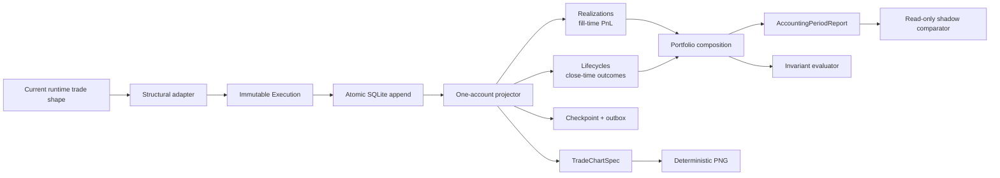

# Architecture V2 Implementation Status

Status: local foundation implemented and regression-tested; no production
cutover or deployment

Last updated: 2026-07-30

## Delivered slice



The accounting dependency direction is one way: adapters normalize facts,
domain code projects one account, application code composes accounts and
reports, and storage/presentation consume those results. Consumers do not
recalculate PnL.

## Source map

| Module | Responsibility |
| --- | --- |
| `domain/identity.py` | validated identities and deterministic UIDs |
| `domain/models.py` | immutable execution, realization, lifecycle, position, account, and portfolio contracts |
| `domain/accounting.py` | pure event-time account projector |
| `application/portfolio.py` | account projection composition only |
| `domain/reports.py` | common period report with separate accounting bases |
| `migrations/001_accounting.sql` | additive, namespaced V2 schema |
| `infrastructure/sqlite_store.py` | atomic ingestion, rebuild, membership, checkpoint, and outbox repository |
| `application/queries.py` | one portfolio period-query handler |
| `adapters/runtime_trade.py` | current runtime shape to immutable execution boundary |
| `domain/charts.py` | shared chart DTO, interval selection, and marker batching |
| `tracker/static_chart.py` | deterministic static chart renderer |
| `application/evaluations.py` | projection invariants and read-only shadow metric differences |

## Accounting guarantees covered by tests

- A repeated execution is stored and projected once.
- A conflicting payload with the same UID is rejected.
- Late/out-of-order fills rebuild only their account in event-time order.
- Accounts are projected independently, then composed.
- Removing an account from a portfolio changes the aggregate without deleting
  its execution history.
- Closing-fill PnL is attributed to the fill period.
- A lifecycle is counted once at its final close/reversal.
- An open lifecycle may have realized PnL and zero closed trades.
- A profitable lifecycle with a losing final dust fill reports the dust loss in
  that fill period and the lifecycle win at close.
- Long, short, explicit hedge sides, fees, partial exits, and reversals retain
  correct semantics.
- Chart markers use transaction colors: BUY green/up, SELL red/down. A short
  close remains BUY/CLOSE SHORT.
- Dense chart batching never merges different actions, sides, candle buckets,
  or lifecycle boundaries.
- Projection evaluation checks references, lifecycle totals, state, unique
  identities, and portfolio/account composition drift.

## Verification

Run only V2:

```powershell
& ".\.venv\Scripts\python.exe" -m pytest -q architecture_v2\tests `
  --basetemp data\pytest-tmp\v2
```

Result on 2026-07-30: **54 passed**.

Run the repository:

```powershell
& ".\.venv\Scripts\python.exe" -m pytest -q `
  --basetemp data\pytest-tmp\full-v2
```

Result on 2026-07-30: **967 passed**, with 294 pre-existing aiohttp
`NotAppKeyWarning` warnings from portfolio-app tests.

## Explicitly not delivered yet

- no production database backfill;
- no production shadow writer or comparison endpoint;
- no dashboard, Telegram, recap, or Journal consumer cutover;
- no native Hyperliquid candle adapter or approved Lighter candle fallback;
- no chart artifact cache or Telegram media-group outbox extension;
- no VM deployment.

## Next safe slice

1. Create anonymized immutable fixtures from the backed-up production snapshot.
2. Add source-specific normalization adapters without changing exchange clients.
3. Run old/V2 comparisons by account, symbol, day, and lifecycle; persist
   evidence with snapshot hash and accounting version.
4. Resolve or classify every difference.
5. Add a read-only internal comparison endpoint.
6. Request explicit approval before the first consumer cutover or deployment.
