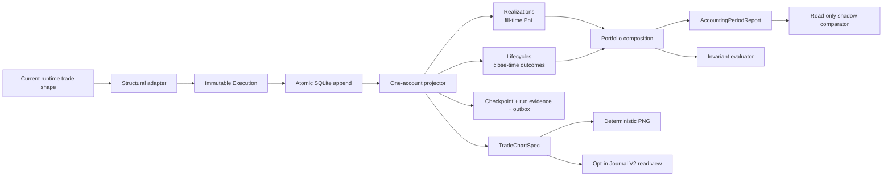

# Architecture V2 Implementation Status

Status: foundation, account/catalog boundaries, immutable per-account ledgers,
run evidence, and read-only Dashboard/Journal adapters are implemented and
regression-tested; no production import, migration, or default consumer cutover

Last updated: 2026-08-04

The architecture decisions for the next slice are recorded in
[`ARCHITECTURE_DECISIONS_2026-08-04.md`](ARCHITECTURE_DECISIONS_2026-08-04.md).
That document is planning authority only; it does not activate a production
write path or consumer cutover.

## Delivered slice



The accounting dependency direction is one way: adapters normalize facts,
domain code projects one account, application code composes accounts and
reports, and storage/presentation consume those results. Consumers do not
recalculate PnL.

## Source map

| Module | Responsibility |
| --- | --- |
| `domain/identity.py` | validated identities and deterministic UIDs |
| `domain/models.py` | immutable execution, realization, lifecycle, position, account, and portfolio contracts |
| `domain/accounting.py` | pure event-time account projector |
| `application/portfolio.py` | account projection composition only |
| `domain/reports.py` | common period report with separate accounting bases |
| `migrations/001_accounting.sql` | additive, namespaced V2 schema |
| `infrastructure/sqlite_store.py` | atomic ingestion, rebuild, membership, cutoff/run manifest, shadow evidence, and outbox repository |
| `infrastructure/catalog_store.py` | central identity, independent account state, label history, and portfolio membership |
| `infrastructure/account_ledger_store.py` | one append-only exchange-fact SQLite ledger per account |
| `infrastructure/verification.py` | non-destructive SQLite backup, restore, hash, and integrity evidence |
| `application/queries.py` | one portfolio period-query handler |
| `adapters/runtime_trade.py` | current runtime shape to immutable execution boundary |
| `domain/charts.py` | shared chart DTO, interval selection, and marker batching |
| `tracker/static_chart.py` | deterministic static chart renderer |
| `trade_journal/v2_consumer.py` | read-only lifecycle-to-V2 chart adapter for the opt-in Journal view |
| `application/evaluations.py` | projection invariants and read-only shadow metric differences |
| `application/read_models.py` | immutable Dashboard and Journal read-only snapshots |
| `domain/policy.py` / `domain/projections.py` | cutoff, run-mode, account-state, lifecycle policy, and deterministic hash contracts |

## Accounting guarantees covered by tests

- A repeated execution is stored and projected once.
- A conflicting payload with the same UID is rejected.
- Late/out-of-order fills rebuild only their account in event-time order.
- Accounts are projected independently, then composed.
- Removing an account from a portfolio changes the aggregate without deleting
  its execution history.
- Closing-fill PnL is attributed to the fill period.
- A lifecycle is counted once at its final close/reversal.
- An open lifecycle may have realized PnL and zero closed trades.
- A profitable lifecycle with a losing final dust fill reports the dust loss in
  that fill period and the lifecycle win at close.
- Long, short, explicit hedge sides, fees, partial exits, and reversals retain
  correct semantics.
- Chart markers use transaction colors: BUY green/up, SELL red/down. A short
  close remains BUY/CLOSE SHORT.
- Dense chart batching never merges different actions, sides, candle buckets,
  or lifecycle boundaries.
- Projection evaluation checks references, lifecycle totals, state, unique
  identities, and portfolio/account composition drift.

## Verification

Run only V2:

```powershell
& ".\.venv\Scripts\python.exe" -m pytest -q architecture_v2\tests `
  --basetemp data\pytest-tmp\v2
```

Result on 2026-08-04: **63 passed** (including the architecture-boundary, cutoff, shadow, and rollout-gate evidence tests).

Run the repository:

```powershell
& ".\.venv\Scripts\python.exe" -m pytest -q `
  --basetemp data\pytest-tmp\full-v2
```

Result on 2026-08-04: **1000 passed**, with 294 pre-existing aiohttp
`NotAppKeyWarning` warnings from portfolio-app tests.

## VM source deployment

Commit `fb229f7325bb7afdb09ad756d65c4a8ecc916608` was installed on
`crypto-apps-vm` on 2026-07-31 IST from the dedicated
`codex/architecture-v2` branch.

Deployment boundary:

- copied `architecture_v2/` and its tracked architecture/operator documents;
- created consistent backups of `events.db`, `command_center.db`, and
  `trading_journal.db` before replacing source;
- ran the V2 smoke scenario and all **54 V2 tests** on Linux/Python 3.12;
- restarted **zero** services;
- ran **zero** database migrations;
- added **zero** `v2_*` tables and **zero** V2 files under production `data/`;
- left dashboard, Telegram, recap, Journal, and exchange ingestion paths
  unchanged.

Rollback and audit evidence:

```text
/home/ADMIN/apps/deploy-backups/architecture-v2-20260730T185018Z
```

The 3,976,194-byte directory contains the prior source targets, three
integrity-checked SQLite snapshots, their hashes, service state, deployed-source
hashes, and post-deployment database integrity evidence. Full procedure and
rollback scope are in
[`VM_SOURCE_DEPLOYMENT.md`](VM_SOURCE_DEPLOYMENT.md).

## Explicitly not delivered yet

- no production database backfill;
- no production shadow writer or comparison endpoint;
- no default dashboard, Telegram, recap, or Journal consumer cutover;
- no V2 write-path activation; the Journal V2 view remains read-only and feature-flagged;
- no native Hyperliquid candle adapter or approved Lighter candle fallback;
- no chart artifact cache or Telegram media-group outbox extension;
- no service or consumer activation of V2.

The architecture contracts are now implemented in the isolated V2 boundary:

- `CatalogStore` owns independent ingestion, alert, portfolio, and historical visibility flags plus label history;
- `AccountLedgerStore` keeps one append-only exchange-fact SQLite file per account;
- `ProjectionWindow` separates context reconstruction from the fixed `2026-06-01T00:00:00Z` report boundary;
- `RunMode` prevents BACKFILL/REPAIR/SHADOW runs from creating integration or notification events;
- run manifests persist input/projection hashes, boundaries, row counts, and alert counts;
- classified shadow comparisons are persisted and queryable by run;
- backup/restore helpers verify SQLite integrity and hashes before rollback evidence is accepted.

Lifecycle holding time is persisted for closed lifecycles and exposed through the Journal read model. Additional MFE/MAE and time-series feature columns remain a future projection version and do not alter the immutable ledger.

## Exchange-basis and cutoff hardening

The lifecycle projector now treats each exit as an execution-time realization:

- exchange-reported PnL is retained when present (for example Hyperliquid
  `closedPnl`);
- otherwise the exchange position immediately before the fill is used as the
  cost basis (required for Lighter scale-ins and partial exits);
- a lifecycle-wide entry VWAP is only a marked fallback for historical rows
  that lack an exchange position basis.

Reconciliation is windowed explicitly. Use
`scripts/reconcile_hl_pnl.py --from-date YYYY-MM-DD` to rebuild only fills at
or after a UTC cutoff; rows before that boundary are preserved. Period reports
use the same `[start, end)` semantics while retaining pre-cutoff position
context so a position already open at the boundary is not mispriced.

## Per-account immutable ledgers

Account ledgers now live under `data/accounts/<account_id>.db` and are
partitioned by stable configured account IDs (`hl-main`, `hl-second`,
`lighter-wallet`, and so on). `exchange_fills` is append-only and keyed by the
exchange-scoped fill UID. If the exchange returns a changed payload for an
existing fill, the change is recorded in `fill_observations`; the canonical
fill row is not rewritten. `pnl_realizations` is a rebuildable projection over
those facts.

The dashboard idempotently migrates the existing shared database into these
files and writes new fills/realizations to the account ledger while retaining
the legacy shared DB for rollback. Backfill reconciliation updates the ledger
and the dashboard/PnL read model but does not enqueue Telegram notifications.

Run `scripts/migrate_account_ledgers.py --apply` to perform the one-time local
migration explicitly; the command is dry-run by default.
Use `scripts/rebuild_account_projections.py --apply` when a preserved shared
archive has already been repaired; it replaces only derived rows at/after
`2026-06-01T00:00:00Z`.

The dashboard now exposes a multi-wallet selector. Analytics rows are filtered
by selected account IDs in the browser, while the server continues to
calculate the canonical all-account view for Telegram commands.

## Next safe slice

1. Create anonymized immutable fixtures from the backed-up production snapshot and run the persisted shadow comparison.
2. Add source-specific normalization adapters without changing exchange clients.
3. Run old/V2 comparisons by account, symbol, day, and lifecycle; persist
   evidence with snapshot hash and accounting version.
4. Resolve or classify every difference.
5. Add a read-only internal comparison endpoint.
6. Request explicit approval before the first consumer cutover or deployment.
