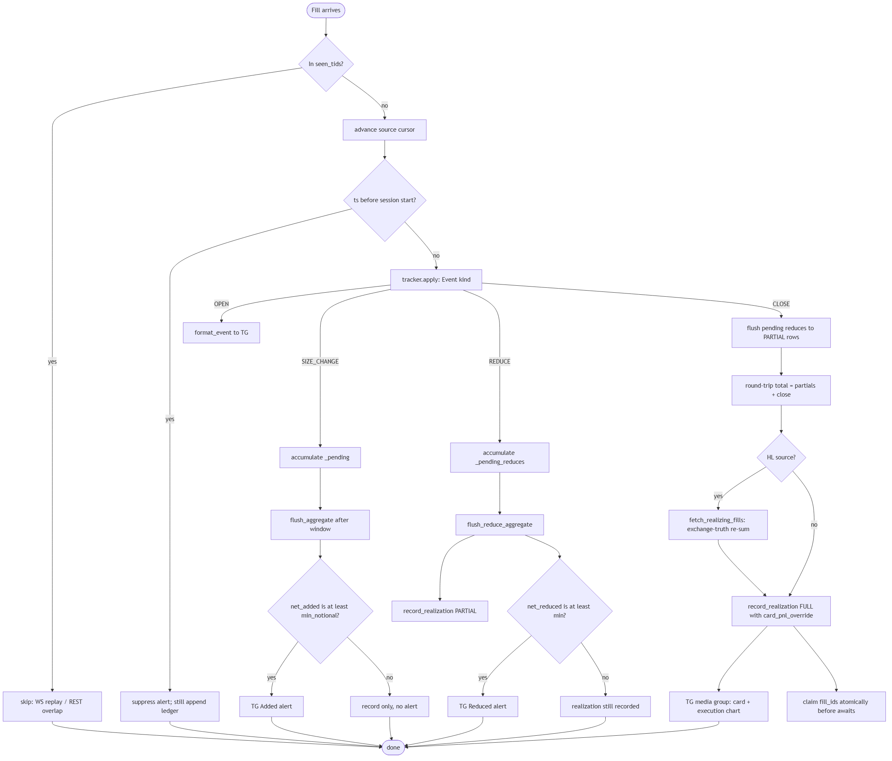

# Data flow — fill to Telegram, step by step

## Producers

Each active source runs three supervised tasks (`_start_source_tasks`):

| Task | What it does |
| --- | --- |
| `ws_producer` | Consumes `src.client.stream_trades()` and pushes `(source_id, Trade)` onto a shared `asyncio.Queue`. |
| `rest_safety_producer` | Every `rest_poll_seconds` (60s) polls `fetch_trades_since(last_trade_id)`; catches anything the WS missed. |
| `position_reconciler` | Every `reconciler_interval_seconds` (30s) pulls authoritative positions, detects new/silently-closed positions, syncs the tracker, caches SL/TP, fetches open orders. |

All three are wrapped in `supervise()` so a crash restarts that one task with
backoff and never stops siblings.

## The consumer (single task)

The queue is drained by ONE consumer to serialize dedup + state writes:

1. Look up the `Source`; normalize `source_id`/`exchange` if missing.
2. **Dedup**: `trade_key = event_uid(source_id)`; skip if in `src.seen_tids`.
3. Advance `src.last_trade_id` and persist the cursor.
4. Append the raw fill to the account ledger (`append_trade`, immutable).
5. **Backfill suppression**: if the fill's timestamp predates the session start
   (grace = max(120s, 2×rest_poll)), skip alerting (still recorded). Cursor was
   already advanced so this can't loop.
6. `events = src.tracker.apply(trade)` → classify.
7. For each event: exclude symbols → set leverage → push to `recent_events` →
   broadcast snapshot → persist event → act by kind:

| Kind | Action |
| --- | --- |
| OPEN | Cancel pending aggregate; fetch+cache SL/TP; freeze privacy anchor; send "Opened" alert (unless reconciler already alerted). |
| SIZE_CHANGE | Accumulate into `_pending`; after the aggregate window, gate on `net_added >= min_notional` → send "Added" (via digest). |
| REDUCE | Accumulate into `_pending_reduces`; on flush: gate on `net_reduced >= min_notional`, then `record_realization(kind=PARTIAL)`. |
| CLOSE | Cancel pending aggregates; flush any pending reduce as PARTIAL; compute round-trip total; (HL) re-sum from exchange `closedPnl`; `record_realization(kind=FULL)`; send card (+ execution chart album). |

## record_realization (the recording core)

```
1. Dedup guard — claim fill_ids in _recorded_realizations SYNCHRONOUSLY.
2. Build synthetic Event for the PnL card (price=fill_price, size=reduced_size).
3. Compute pct from real avg_entry/fill_price; wins/total only advance on FULL.
4. Generate card PNG (privacy-transformed for HL; PnL exact).
5. FULL + card: generate execution chart (candles best-effort → execution-only).
6. Write card PNG to data/cards/, compute HL display fields (in-memory only).
7. Save closed_trades row (REAL values) + account-ledger realization.
8. Insert into in-memory closed_trades (newest-first), refresh_stats(), broadcast.
9. Return {"card_path", "chart_bytes"}.
```

## Telegram delivery (with fallbacks)

- FULL close: `tg_send_media_group(card, chart)` — if album fails, falls back to
  `tg_send_photo(card)`; if that fails, falls back to `tg_send(text)`.
  Exactly one safe fallback; chart failure never suppresses the card.
- Outbox idempotency: `notification_outbox` keyed by `event_uid`. `sent` never
  re-sent; `failed` reclaimable after 5 min.
- Rate limiting: single `_tg_channel_lock`, min 1.1s gap, honors 429
  `retry_after` (max 120s).
- Session digest: add/reduce alerts buffered per source for `digest_window_seconds`,
  then combined into one message (chunked under 4096 chars).

## Privacy transform (HL only)

- Frozen anchor entry seeded at OPEN per (source, market).
- `price_factor = HMAC(secret, source|symbol|side|bucket)` → one jitter f per position.
- Applied at every public surface: formatter, card, dashboard rows, events
  table, open orders. PnL/%/win-rate never transformed.
- See `easy/PRIVACY.md` and `diagrams/privacy-flow.png`.

## Reconciliation flow



## Persistence boundaries

- `data/events.db` — tracker archive + compatibility.
- `data/accounts/<id>.db` — immutable exchange facts + rebuildable realizations.
- `data/cards/` — PNG cards (public via `/cards/`).
- `data/live_positions.json` — local journal position snapshot (raw, not public).
- Other apps own their own DBs (`trading_journal.db`, `command_center.db`, …).
