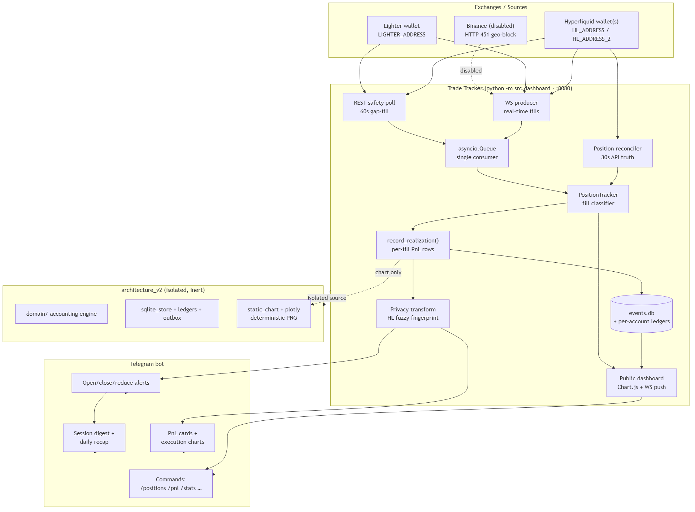
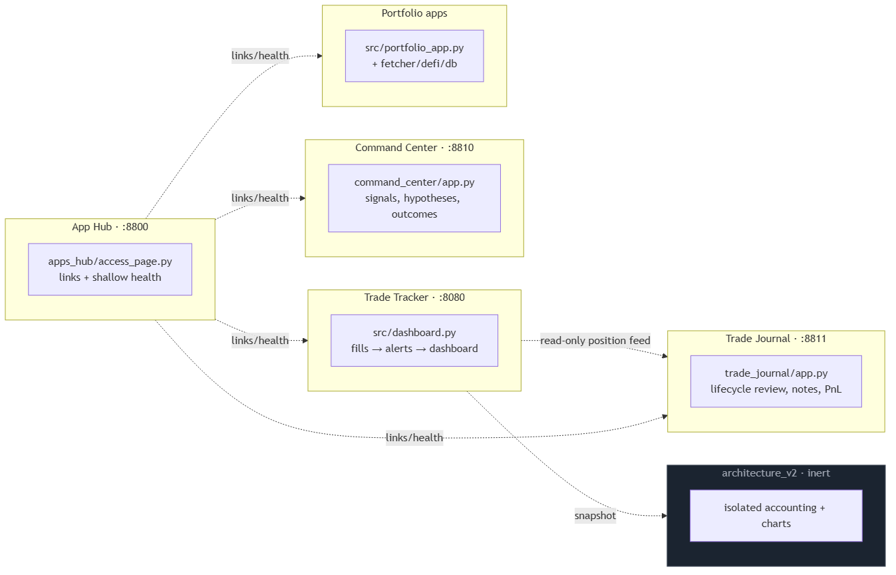
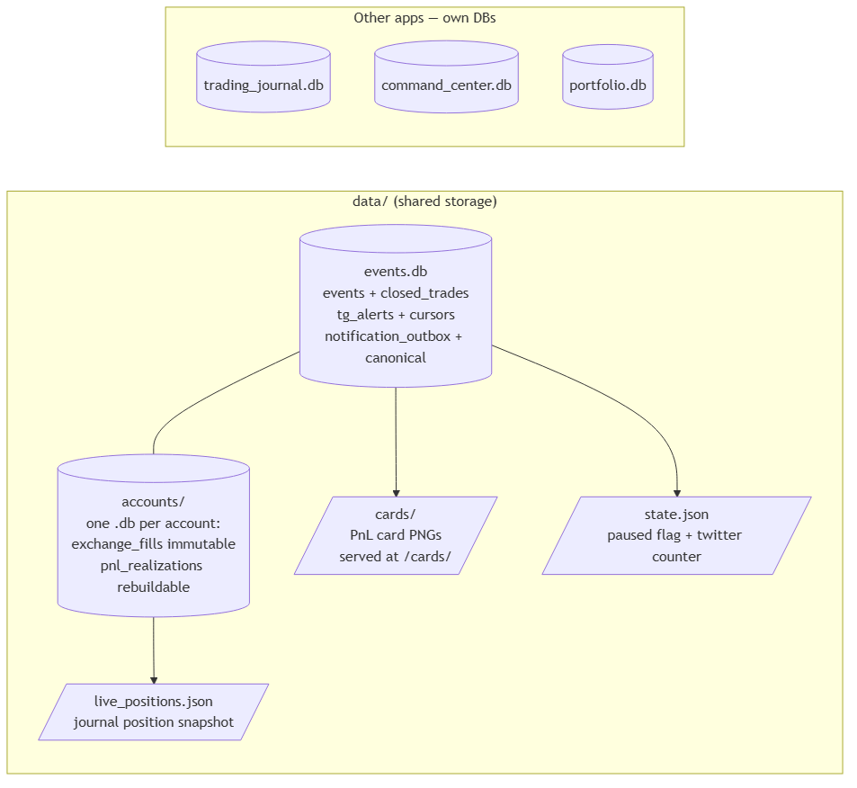

# Overview — what this system is

A trading tracker that watches your **Hyperliquid (HL)** wallet and **Lighter**
pool, turns every fill into a trade event, records the PnL, and notifies you on
**Telegram** while also serving a **public web dashboard**.

## The one-sentence story

> Exchange fills come in two ways (fast WebSocket + slow REST safety net), a
> single consumer thread classifies each fill (open / add / reduce / close),
> realizations are written per-fill to SQLite, and Telegram + the dashboard show
> the result — with Hyperliquid prices/sizes blurred so your wallet can't be
> fingerprinted, while the PnL numbers stay exact.

## The moving parts, in plain English

| Component | What it does | Where |
| --- | --- | --- |
| **Sources** | The accounts being watched (HL wallets, Lighter pool). Each has its own client + position tracker. | `config.yaml` + `src/sources.py` |
| **Producers** | Two ways fills get into the system: live WebSocket, and a 60s REST poll that catches anything the WS missed. | `src/dashboard.py` (ws_producer, rest_safety_producer) |
| **Consumer** | A single asyncio task. It de-duplicates fills, classifies them, and does all the recording. One task = no lock fights. | `src/dashboard.py` (consumer) |
| **Position tracker** | Decides what a fill *means*: a new position (OPEN), a same-side add (SIZE_CHANGE), a partial close (REDUCE), or a full close (CLOSE). | `src/position_tracker.py` |
| **Realization recorder** | Writes one DB row per scale-out and one per full close, generates the PnL card PNG, and may fetch HL's own `closedPnl` as ground truth. | `src/dashboard.py` (record_realization) |
| **Telegram** | Cards, open/close/reduce alerts, a session digest, a daily recap, and slash commands. | `src/dashboard.py`, `src/telegram_commands.py` |
| **Dashboard** | Public Chart.js page; live-updates browsers over WebSocket. | `src/dashboard.py` (:8080) |
| **Privacy layer** | Blurs HL price/size/notional/timestamp; keeps PnL exact. See [privacy diagram](../diagrams/privacy-flow.png). | `src/display_transform.py` |
| **Reconciler** | Every 30s pulls ground-truth positions from the exchange to catch silent closes and re-sync the tracker. | `src/dashboard.py` (position_reconciler) |
| **V2 accounting** | An isolated, *not yet live* accounting engine + chart renderer. It must stay inert. | `architecture_v2/` |

## How a trade travels through the system

See the [lifecycle sequence diagram](../diagrams/trade-lifecycle.png) for the
full picture. The short version:

1. Fill arrives → dedupe (set + persisted cursor).
2. Tracker classifies it.
3. **Reduce** fills are batched for ~60s, then recorded as a PARTIAL row.
4. **Close** = flush remaining reduces, sum the round-trip, record the FULL row,
   send the card (+ execution chart) as a Telegram album.
5. Every row is stored with real values; privacy blur happens only when *showing*
   HL data.

## The four services

There are separate apps that share nothing but the repo and the VM:

| App | Port | Owns |
| --- | --- | --- |
| Trade Tracker | 8080 | live tracking + Telegram + dashboard |
| Trade Journal | 8811 | lifecycle review, notes |
| Command Center | 8810 | signals, hypotheses, outcomes |
| App Hub | 8800 | links + shallow health |
| Portfolio apps | (various) | account/asset views |

## The data

`data/events.db` is the tracker's main DB (events, closed trades, alert log,
cursors, notification outbox, canonical-ledger tables). Per-account ledgers
live in `data/accounts/<id>.db` and are append-only (immutable exchange facts +
rebuildable PnL rows). PnL card PNGs live in `data/cards/`.

## TL;DR safety rules

- HL wallet address lives **only** in `.env` — never in config, logs, or chat.
- PnL figures are **always exact**; HL prices/sizes are **always blurred** on public surfaces.
- Restarting the live `lighterbot` service needs your explicit OK.
- `architecture_v2/` must stay **read-only** until an explicit cutover is approved.
