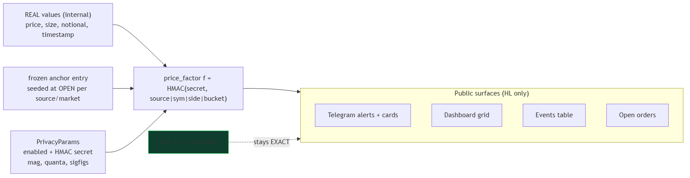

# Privacy — "exact results, fuzzy fingerprint"

## The deal

Anyone can open the public dashboard and see your trades. The bot therefore
shows **fuzzy** versions of your Hyperliquid prices/sizes/timestamps, but
**exact** PnL numbers. That way followers can't reconstruct your wallet, but the
honest results are never faked.

## What stays EXACT

- PnL in `$`
- PnL as a percentage
- Win rate / wins / losses
- Net, gross profit, gross loss

## What gets blurred (HL only)

- Entry / exit price — jittered by a small deterministic factor (±0.3%)
- Size — rounded to 2 significant figures
- Notional — rounded to 2 significant figures
- Timestamps — shown as "~3m ago" style (relative)

Lighter is **never** blurred — it's already public by design.

## Why you can trust the blur

The jitter factor is derived from a **secret salt** (`PRIVACY_SECRET_KEY`) plus
the coin/side and a frozen **anchor price** captured at OPEN time. That means:

- The same position looks the same on every alert/card/dashboard (one factor).
- You can't reverse it without the salt.
- PnL is computed from the *real* prices before blur is applied.

## Master switch

Set `privacy_enabled: false` in `config.yaml` to instantly show 100% real values
(e.g. for your own private deployment).

## What we just fixed (2026-08-04)

The **events table** on the dashboard used to send raw real HL prices to the
browser (the JS fell back to `t.price` when the per-row `_disp` privacy fields
were missing). Now every HL event is serialized with its privacy fields attached
and the real numbers stripped — so a raw WebSocket reader can't recover them
either. See `src/dashboard.py` `_recent_event_payload()`.

## Check it

1. Open the dashboard events table with an HL source active.
2. Prices/sizes should look rounded/odd, and the "last event" line shows
   relative time, not an exact timestamp.
3. The PnL numbers on cards/tiles/stats must still be exact (2 decimal places).

If you see **exact HL prices on any public surface**, that's a privacy bug — flag it.
